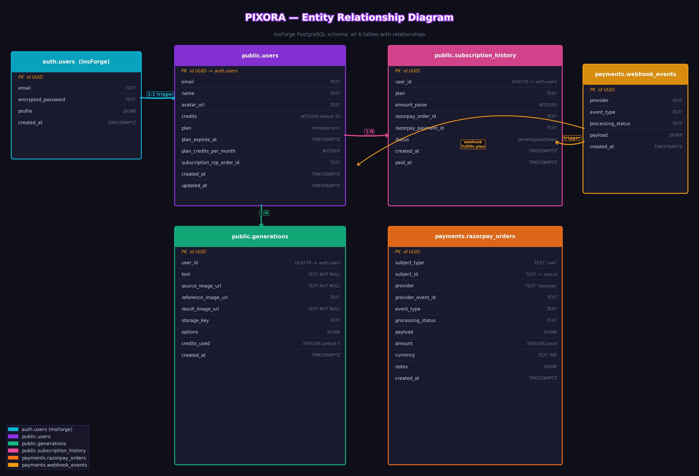
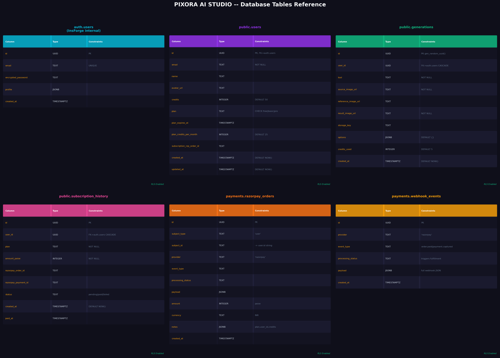
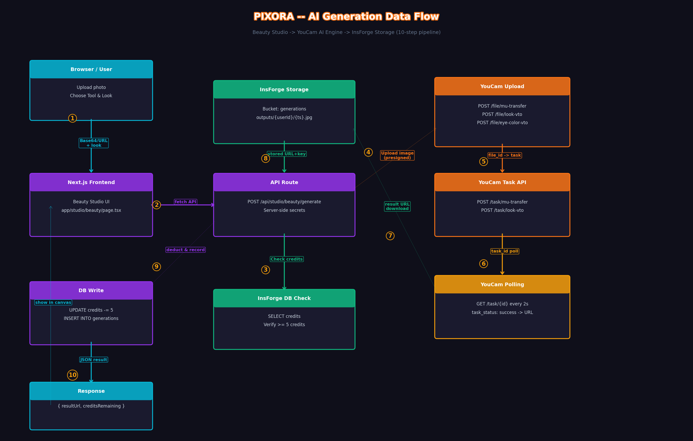
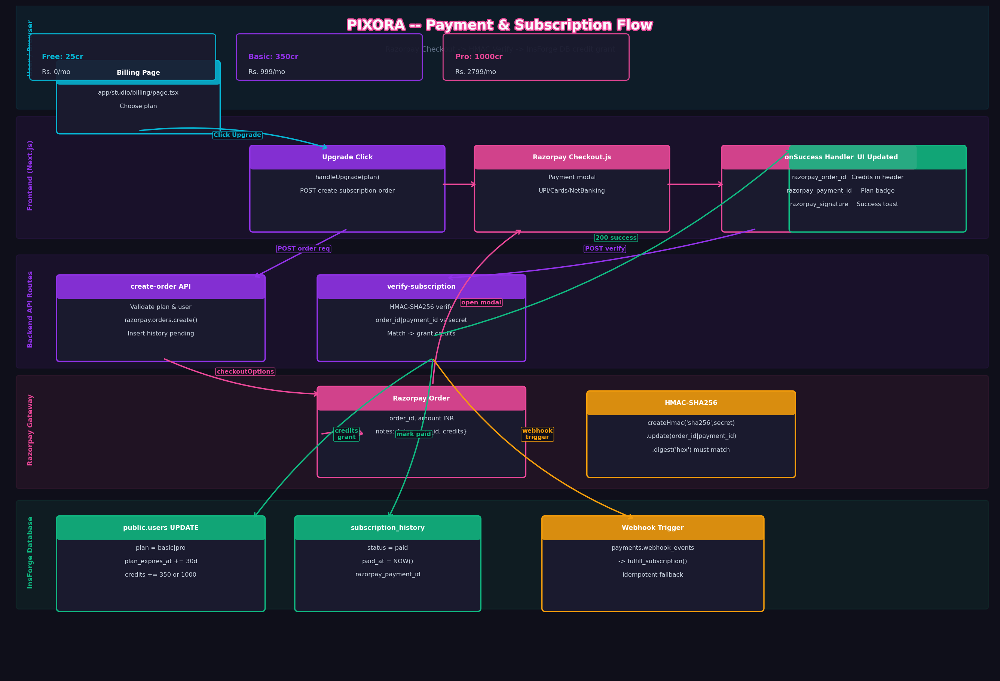
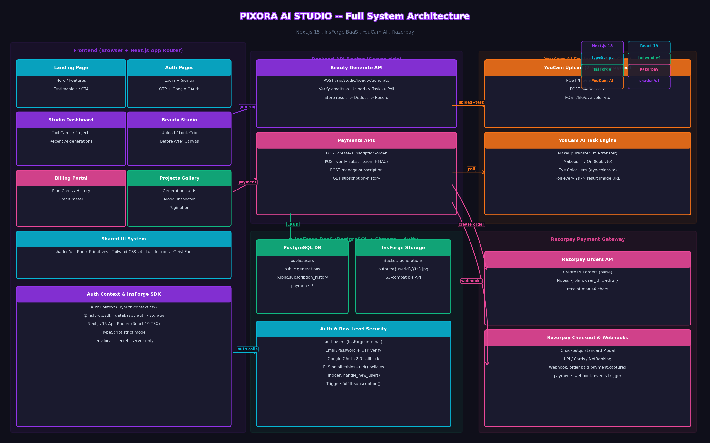

# 📊 Pixora AI Studio — System Architecture & Data Flow Diagrams

This directory contains automated, high-resolution architectural diagrams and data flow visualizations for the Pixora AI Photo Studio platform. All diagrams are generated programmatically using Python and `matplotlib` with a custom dark-mode design system.

---

## 📑 Diagram Index

1. [📐 Entity Relationship (ER) Diagram](#1--entity-relationship-er-diagram)
2. [🗄️ Database Tables Reference](#2-️-database-tables-reference)
3. [⚡ AI Generation Data Flow](#3--ai-generation-data-flow)
4. [💳 Payment & Subscription Flow](#4--payment--subscription-flow)
5. [🏛️ Full System Architecture](#5-️-full-system-architecture)

---

## 1. 📐 Entity Relationship (ER) Diagram

Visualizes the PostgreSQL relational model managed via InsForge BaaS, including primary keys, foreign keys, and referential constraints across authentication, user profiles, AI generations, and billing audit logs.



### Key Relational Entities:
- **`auth.users`**: InsForge internal auth store containing secure credentials, identities, email confirmation flags, and timestamps.
- **`public.users`**: Core user profiles, current available credits, active subscription plan (`free`, `basic`, `pro`), and expiration date.
- **`public.generations`**: Audit trail of all AI photo processing runs, referencing `public.users(id)`.
- **`public.subscription_history`**: Razorpay transaction and plan purchase ledger linked to `public.users(id)`.
- **`payments.orders` & `payments.webhook_events`**: Low-level payment processing and idempotent webhook event logs.

---

## 2. 🗄️ Database Tables Reference

A comprehensive field-by-field breakdown of the PostgreSQL schema including data types, default values, constraints, active Row-Level Security (RLS) policies, and automated database triggers.



### Core Schema Highlights:
- **`handle_new_user()` Trigger**: Automatically provisions a `public.users` record with 50 complimentary credits upon initial registration or Google OAuth login.
- **`fulfill_subscription_from_webhook()` Trigger**: Atomically grants credits and updates the user's tier when Razorpay webhooks fire for `order.paid` or `payment.captured`.
- **Row-Level Security (RLS)**: Enforces that users can only select, insert, or update their own records using `auth.uid() = user_id`.

---

## 3. ⚡ AI Generation Data Flow

Illustrates the end-to-end asynchronous pipeline from the moment a user uploads a portrait or selects a preset in the Studio canvas to final rendering and persistent storage.



### Step-by-Step Flow:
1. **User Action**: User uploads a source photo and chooses an AI tool & preset (e.g. Makeup Transfer, Eye Color Try-on).
2. **Next.js API Route (`/api/studio/beauty/generate`)**:
   - Authenticates request and validates credit balance (minimum 5 credits required).
   - Generates presigned upload URLs with the YouCam AI infrastructure.
3. **Presigned Upload**: Source and reference images are securely uploaded directly to YouCam processing buckets.
4. **AI Inference Job**: Launches asynchronous AI task (`mu-transfer`, `look-vto`, or `eye-color-vto`).
5. **Fast Polling Engine**: Polls task status every 2 seconds until `task_status: "success"` with exponential backoff.
6. **Persistence & Credit Deduction**:
   - Stores output asset in InsForge Storage (`outputs/{userId}/{filename}.jpg`).
   - Atomically deducts 5 credits from `public.users`.
   - Records generation entry in `public.generations`.
7. **Canvas Rendering**: Returns output URL to client for instant interactive before/after slider comparison.

---

## 4. 💳 Payment & Subscription Flow

Details the 3-tier subscription lifecycle, Razorpay Standard Checkout modal integration, cryptographic verification, and webhook fulfillment.



### Subscription Lifecycle:
1. **Plan Selection**: User chooses Free (₹0/mo, 25 credits), Basic (₹999/mo, 350 credits), or Pro (₹2,799/mo, 1000 credits).
2. **Order Initialization (`/api/payments/create-subscription-order`)**:
   - Creates Razorpay order in INR paise with embedded metadata (`plan`, `user_id`, `credits`).
   - Inserts pending row in `public.subscription_history`.
3. **Checkout.js Modal**: Opens Razorpay popup supporting UPI (GPay, PhonePe, Paytm), Credit/Debit Cards, and NetBanking.
4. **HMAC-SHA256 Verification (`/api/payments/verify-subscription`)**:
   - Validates payment signature: `HMAC_SHA256(order_id + "|" + payment_id, secret)`.
   - Upgrades `public.users.plan` and sets `plan_expires_at` to +30 days.
   - Atomically increments user credits by plan allowance.
   - Marks transaction as `paid` in `subscription_history`.
5. **Webhook Backup (`payments.webhook_events`)**: If user closes browser before callback, background webhook trigger automatically fulfills the order.

---

## 5. 🏛️ Full System Architecture

High-level multi-tier architecture diagram showing the relationship between the client frontend, Next.js fullstack backend, InsForge serverless BaaS, and third-party AI / payment platforms.



### Architecture Layers:
- **Client Layer**: Next.js App Router, React 19, Tailwind CSS v4, Lucide Icons, interactive HTML5 canvas slider.
- **Server / API Layer**: Next.js Route Handlers (`app/api/`) executing protected server-side logic and managing third-party secrets.
- **BaaS Layer (InsForge)**: Managed PostgreSQL 15, Auth engine with OTP/OAuth, and S3-compatible Object Storage.
- **External Services**:
  - **YouCam AI Engine**: Asynchronous computer vision and generative styling models.
  - **Razorpay Payments**: Secure payment gateway and webhook emitter.

---

## 🛠️ How to Regenerate Diagrams

To modify or regenerate these diagrams, run the Python script from the project root:

```bash
# Ensure matplotlib is installed
pip install matplotlib

# Run the diagram generator
python diagrams/pixora_diagrams.py
```

The script will automatically re-render all 5 PNG files in the `diagrams/` folder at 155 DPI with the Pixora dark theme.
